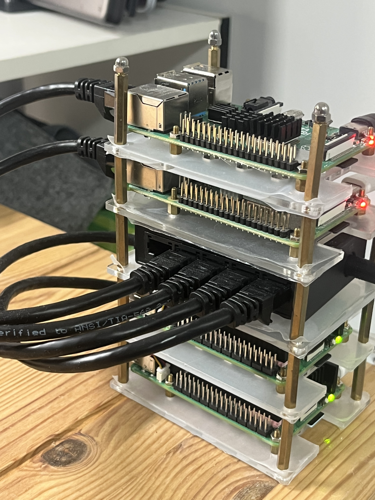
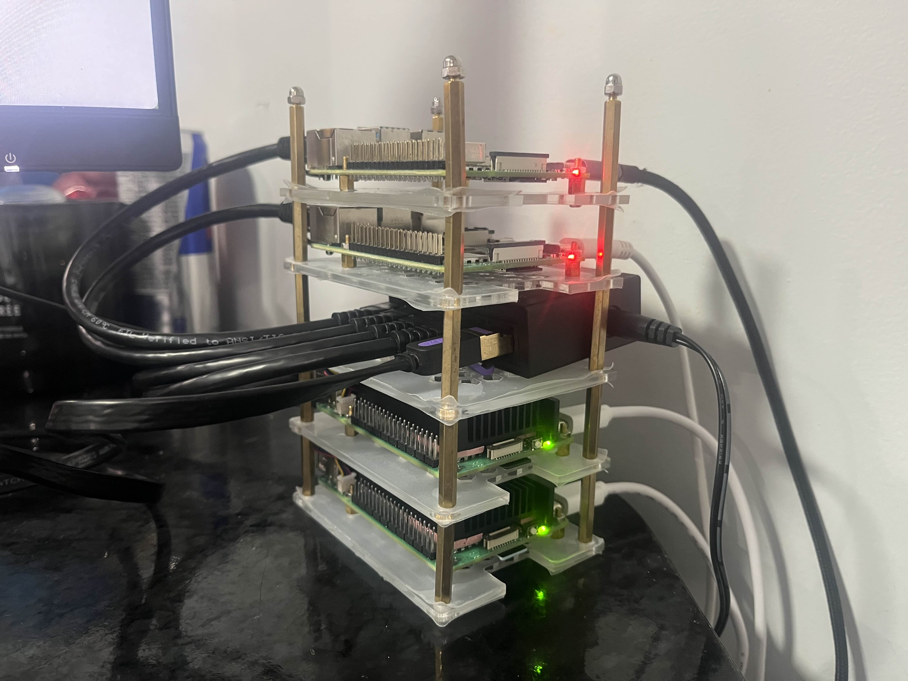

# Raspberry Pi Cluster (`pi-cluster`)

<<<<<<< HEAD
=======
A home-lab Raspberry Pi cluster running K3s, AI workloads with Kagent & Ollama, and GitOps with ArgoCD.

---

## 📸 Cluster Setup

<table>
  <tr>
    <td></td>
    <td></td>
  </tr>
</table>

---

## 🗂️ Repository Structure

* **[`ansible/`](file:///Users/manh/Documents/pi-cluster/ansible)**: Bare-metal configuration, OS provisioning, network settings, cgroups, and K3s cluster initialization (`master`, `worker1`, `worker2`).
* **[`k8s/`](file:///Users/manh/Documents/pi-cluster/k8s)**: Kubernetes manifests, base namespaces, and Kustomize configurations for workloads.
* **[`kagent/`](file:///Users/manh/Documents/pi-cluster/kagent)**: [Kagent](https://github.com/kagent-dev/kagent) CNCF Sandbox agentic AI framework quickstart, Helm values, and custom Agent manifests.
* **[`argocd/`](file:///Users/manh/Documents/pi-cluster/argocd)**: ArgoCD GitOps application manifests and setup instructions.
* **[`.github/workflows/`](file:///Users/manh/Documents/pi-cluster/.github/workflows)**: GitHub Actions CI workflow for linting YAML files and validating Kubernetes manifests.

---

## 🚀 Quick Navigation

1. **Bare-metal / K3s setup**: See [ansible/README.md](file:///Users/manh/Documents/pi-cluster/ansible/README.md)
2. **Kagent Agentic AI setup**: See [kagent/README.md](file:///Users/manh/Documents/pi-cluster/kagent/README.md)
3. **ArgoCD GitOps setup**: See [argocd/README.md](file:///Users/manh/Documents/pi-cluster/argocd/README.md)
4. **Kubernetes manifests**: See [k8s/README.md](file:///Users/manh/Documents/pi-cluster/k8s/README.md)
>>>>>>> a51438b (fix repo and add k8s, argo, kagent)
